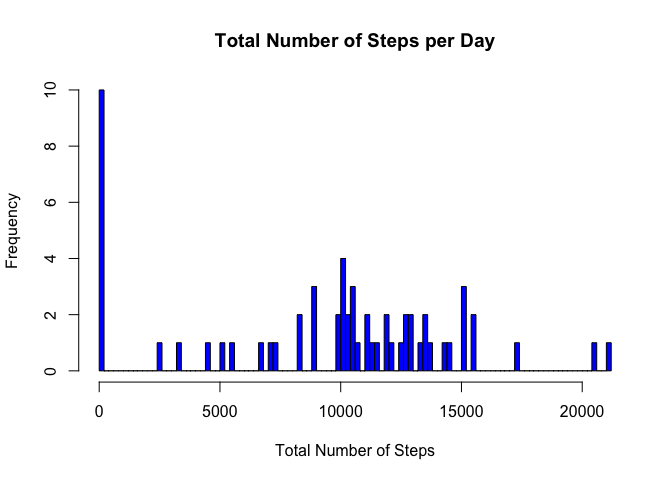
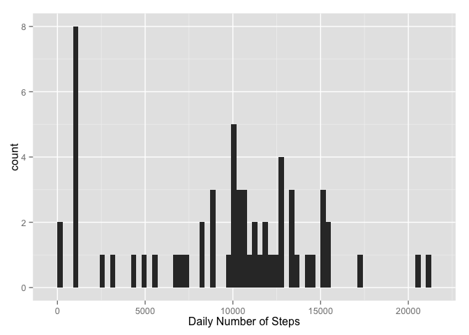

# Reproducible Research: Peer Assessment 1
Isaac Ben-Akiva  


## Loading and preprocessing the data


```r
library(ggplot2)
activity_data <- read.csv("activity.csv", header = TRUE, sep = ",")
summary(activity_data)
```

```
##      steps                date          interval     
##  Min.   :  0.00   2012-10-01:  288   Min.   :   0.0  
##  1st Qu.:  0.00   2012-10-02:  288   1st Qu.: 588.8  
##  Median :  0.00   2012-10-03:  288   Median :1177.5  
##  Mean   : 37.38   2012-10-04:  288   Mean   :1177.5  
##  3rd Qu.: 12.00   2012-10-05:  288   3rd Qu.:1766.2  
##  Max.   :806.00   2012-10-06:  288   Max.   :2355.0  
##  NA's   :2304     (Other)   :15840
```

```r
activity_data$date <- as.Date(activity_data$date, format="%Y-%m-%d")
activity_data$interval <- factor(activity_data$interval)
```

## What is mean total number of steps taken per day?

1. Calculate the total number of steps taken per day

```r
num_steps <- tapply(activity_data$steps, activity_data$date, sum, na.rm = TRUE)
```

2. Make a histogram of the total number of steps taken each day

```r
hist(num_steps, breaks = 100, main = "Total Number of Steps per Day", xlab = 'Total Number of Steps', col = 'blue')
```

 

3. Calculate and report the mean and median of the total number of steps taken per day

Mean of Total Number of Steps per Day


```r
mean(num_steps)
```

```
## [1] 9354.23
```

Median of Total Number of Steps per Day


```r
median(num_steps)
```

```
## [1] 10395
```


## What is the average daily activity pattern?

Make a time series plot


```r
steps_interval <- aggregate(activity_data$steps, by = list(activity_data$interval), mean, na.rm=TRUE)
steps_median <- aggregate(activity_data$steps, by = list(activity_data$interval), median, na.rm=TRUE)

steps_interval <- cbind(steps_interval[], steps_median$x)
names(steps_interval) = c("interval","mean.steps", "median.steps")
steps_interval$mean.steps <- round(steps_interval$mean.steps)
steps_interval$median.steps <- round(steps_interval$median.steps)

with(steps_interval, { plot(steps_interval$mean.steps, type = "l", main="Time-Series of Average Steps/Interval", xlab="5 minute Interval", ylab="Average Steps across all Days")})
```

 

Which 5-minute interval, on average across all the days in the dataset, contains the maximum number of steps?

```r
steps_interval$interval[which.max(steps_interval$steps)]
```

```
## factor(0)
## 288 Levels: 0 5 10 15 20 25 30 35 40 45 50 55 100 105 110 115 120 ... 2355
```

## Imputing missing values

Calculate and report the total number of missing values in the dataset (i.e. the total number of rows with NAs)


```r
nrow(activity_data[!complete.cases(activity_data), ])
```

```
## [1] 2304
```

#imputing missing step values with mean step at time interval

```r
nstps <- data.frame(date=activity_data$date[is.na(activity_data$steps)], interval = activity_data$interval[is.na(activity_data$steps)], steps=steps_interval[match(steps_interval$interval, activity_data$interval[is.na(activity_data$steps)]),3])

# remove the NA's from the period
activity_data <- subset(activity_data, !is.na(steps))

# Append the median steps to the Activity DF
activity_data <- rbind(activity_data, nstps)

#sum the number of steps each day into the dailysteps2 DF and get the mean and median 
dailysteps2 <- aggregate(activity_data$steps, by = list(activity_data$date), sum, na.rm=TRUE)
names(dailysteps2) <- c("Date", "steps")

qplot(steps, data = dailysteps2, geom="histogram", xlab = "Daily Number of Steps", binwidth = 300)
```

 

## Are there differences in activity patterns between weekdays and weekends?

# Add the Weekday and Weekend identifier


```r
daytype <- function(date) {
    if (weekdays(as.Date(date)) %in% c("Saturday", "Sunday")) {
        "weekend"
    } else {
        "weekday"
    }
}

activity_data$daytype <- as.factor(sapply(activity_data$date, daytype))

par(mfrow = c(2, 1))
for (type in c("weekend", "weekday")) {
    steps.type <- aggregate(steps ~ interval, data = activity_data, subset = 
        activity_data$daytype == type, FUN = mean)
    plot(steps.type, type = "l", main = type)
}
```

 
